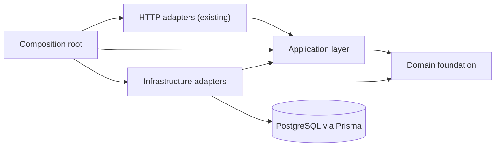

# Application Architecture

## Scope

Phase 3A establishes application boundaries only. It does not add HTTP endpoints, CRUD use cases, booking rules, payment processing, commission calculation, UI, or database models. The Prisma schema and authentication implementation remain unchanged.

## Layers

- **Domain foundation** owns `Result`, domain failures, clock and ID ports, specifications, and domain-event contracts. It has no Prisma or Express dependency.
- **Application foundation** owns repository, transaction, policy, query, logging, metrics, and feature-flag ports.
- **Infrastructure** implements those ports with Prisma, system time, UUIDs, console JSON logging, and no-op metrics.
- **Composition root** is the only construction point for the Phase 3A dependency graph. Dependencies use constructor injection; no DI library is required.

## Error Flow

Business code returns `Result<T, DomainError>` and does not throw for validation, conflict, missing resources, authorization, business rules, concurrency, or tenant isolation. Infrastructure may still throw unexpected technical faults so the existing global HTTP error boundary can record and sanitize them.

## Time And Identity

Business code receives `Clock` and `IdGenerator`. `SystemClock` and `UuidGenerator` are infrastructure adapters. `FixedClock` provides deterministic unit tests. `today()` is a UTC `YYYY-MM-DD` value; organization-local calendar conversion belongs to a future dedicated timezone service.

## Configuration And Observability

`FEATURE_FLAGS` is a validated JSON object of boolean flags. Unknown or absent flags evaluate to `false`. `Logger`, `Counter`, `Timer`, and `Histogram` are vendor-neutral ports. Current metrics use a no-op adapter until an observability provider is selected.

## Phase 3B Boundary

Phase 3B use cases should depend only on application/domain ports, accept dependencies through constructors, return `Result`, authorize resources through policies, and use a transaction scope for multi-repository writes. Controllers translate HTTP input/output but must not call Prisma.

