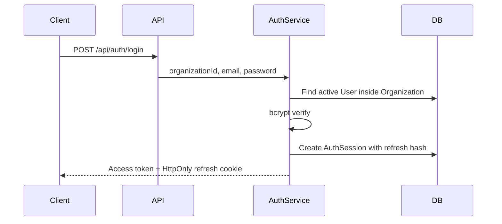
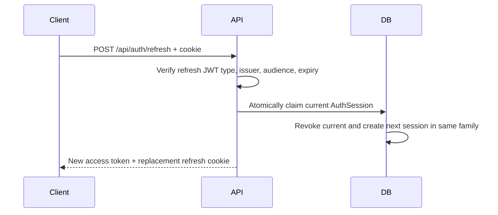

# Authentication

## Overview

Phase 2 ใช้ access JWT อายุสั้นและ refresh JWT แบบ rotating session Access token ส่งผ่าน `Authorization: Bearer`; refresh token ส่งผ่าน cookie `salon_refresh` ที่เป็น HttpOnly, SameSite และ Secure ใน production ระบบเก็บเฉพาะ SHA-256 hash ใน `AuthSession` และไม่เก็บ token ดิบ

Login ต้องรับ `organizationId` เพราะ email unique ภายใน Organization ไม่ใช่ทั้งระบบ

## Login Flow

ไม่เปิดเผยว่า organization, email หรือ password ส่วนใดผิด และ bcrypt dummy comparison ลดความต่างของ response timing เมื่อไม่พบ user

## Refresh Rotation

การ claim ทำใน serializable transaction หาก refresh token ที่ rotate แล้วถูกใช้ซ้ำ ระบบ revoke session ที่ยัง active ทั้ง token family และตอบ `AUTH_005`

## Logout

`POST /api/auth/logout` ต้องมี access token ระบบ revoke session จาก `sid` claim และ clear refresh cookie เนื่องจาก authentication middlewareตรวจ AuthSession ทุก request access token เดิมจึงใช้ต่อไม่ได้ทันที

## JWT Claims

| Claim | ความหมาย |
| --- | --- |
| `sub` | User UUID |
| `org` | Organization UUID |
| `sid` | AuthSession UUID |
| `fid` | Token-family UUID เฉพาะ refresh token |
| `typ` | `access` หรือ `refresh` |
| `jti` | Token UUID |
| `iss`, `aud`, `exp` | Issuer, audience และ expiration |

Access และ refresh token ใช้ secret คนละชุดและยอมรับเฉพาะ `HS256`

## Configuration

Secrets ต้อง inject จาก AWS Secrets Manager ใน production:

- `JWT_ACCESS_SECRET`
- `JWT_REFRESH_SECRET`
- `DATABASE_URL`

Policy และ TTL กำหนดผ่าน `JWT_ISSUER`, `JWT_AUDIENCE`, `JWT_ACCESS_TTL_SECONDS`, `JWT_REFRESH_TTL_SECONDS`, `COOKIE_SECURE` และ `COOKIE_SAME_SITE`
