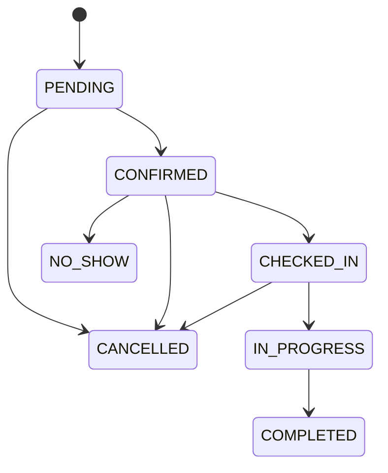

# Booking Engine

## Scope

Phase 4 implements availability, booking lifecycle, item scheduling, search, and calendar reads. It uses the frozen application foundation: repository interfaces, `TransactionManager`, policy engine, Result pattern, domain events, clock, ID generator, audit middleware, tenant context, and branch context. Payment, POS, commission, promotions, notifications, reports, and UI are outside this phase.

## Use Cases

- Availability: `GetBookingAvailability`, `GetEmployeeAvailability`, `GetBranchCalendar`.
- Booking: `CreateBooking`, `UpdateBooking`, `GetBooking`, `GetBookingList`, `SearchBooking`, `CancelBooking`, `RescheduleBooking`.
- Status: `ConfirmBooking`, `CheckInBooking`, `StartBooking`, `CompleteBooking`, `MarkNoShow`.
- Items: `AddBookingItem`, `UpdateBookingItem`, `RemoveBookingItem`.

Every use case goes through `BookingRepository`. Every write runs in `TransactionManager.withTransaction()` and returns `Result<T, DomainError>` for expected failures.

## Business Rules

- The authenticated organization and resolved branch are authoritative. Customers and resources must belong to that organization; branch-scoped requests must match branch context.
- A booking needs an active customer and at least one active item. Bookings are never hard-deleted. Item removal changes its status to `CANCELLED` and retains the snapshot.
- Create, reschedule, and item changes require a future, slot-aligned time. Item changes and rescheduling are limited to `PENDING` and `CONFIRMED` bookings.
- Services and `BranchService` rows must be active. Branch price/duration overrides win; null overrides fall back to the service defaults.
- Employees must be active, assigned to the branch, meet all required skill levels, be inside effective working hours, and have no pending/approved time off or active booking overlap.
- Closed holidays block availability. Overnight bookings are rejected. Booking items are sequential and non-overlapping.
- Auto assignment chooses an eligible available employee deterministically by current load and then employee ID.

## Availability Engine

The engine receives normalized repository data and is independent from Prisma. It validates branch services, skill requirements, employee schedules, time off, closed holidays, existing booking items, and the mandatory `booking.slot_interval_minutes` setting. A branch setting overrides the organization setting; valid values are integer minutes from 5 through 60.

Inputs use an ISO date and optional `HH:mm:ss`. The branch IANA timezone is used, falling back to organization timezone. Results contain availability, eligible employees, concrete UTC slot ranges, unavailable reasons, computed duration, and effective price. Calendar supports `DAY`, `WEEK` (Monday start), optional employee filtering, and branch filtering.

## Conflict Detection

The following booking statuses consume capacity: `PENDING`, `CONFIRMED`, `CHECKED_IN`, and `IN_PROGRESS`. `COMPLETED`, `CANCELLED`, and `NO_SHOW` do not block future checks.

- Employee conflicts are checked through active `BookingItem` ranges.
- Customer conflicts are checked across every branch in the same organization.
- Reschedule and item mutations exclude the booking being edited, then recompute the complete affected range.
- Adding an item checks the extended booking range. Updating/removing an item compacts and validates all following items.

## State Machine

Transitions outside this graph return a business-rule failure. `IN_PROGRESS` changes active items to `IN_SERVICE`; `COMPLETED` changes them to `COMPLETED`; cancellation/no-show changes them to `CANCELLED`.

## Snapshot Strategy

Each item snapshots `serviceName`, service/employee IDs, effective duration, quantity, unit price, discount, subtotal, tax type/mode/rate/amount, total, notes, and scheduled range. Monetary arithmetic uses integer cents and half-up division. Included VAT is extracted from the price; excluded VAT is added. Booking totals are derived from non-cancelled item snapshots, never from current catalog values.

## Concurrency Strategy

Writes use PostgreSQL serializable transactions plus sorted transaction-scoped advisory locks. Lock keys cover the booking and, where schedules change, customer/date and employee/date; create also locks branch/date. The engine reloads availability and checks conflicts again after acquiring locks. Serialization failures are returned through the existing `CONCURRENCY` Result mapping.

## API And Policy

All endpoints are under `/api/bookings`, require authentication and resolved branch context, run permission middleware, validate with Zod, invoke a policy-checked use case, and use the shared Result-to-HTTP response mapping. See `docs/API.md` for routes.

Permissions: `booking.create`, `booking.read`, `booking.update`, `booking.cancel`, `booking.reschedule`, `booking.status.update`, `booking.availability.read`, and `booking.item.manage`.

## Events

The in-process dispatcher publishes `BookingCreated`, `BookingUpdated`, `BookingCancelled`, `BookingRescheduled`, `BookingConfirmed`, `BookingCheckedIn`, `BookingStarted`, `BookingCompleted`, `BookingMarkedNoShow`, `BookingItemAdded`, `BookingItemUpdated`, and `BookingItemRemoved` after successful writes. HTTP handlers attach corresponding audit actions to the existing audit pipeline; use cases never write audit rows directly.

## Error Cases

Expected failures include inactive/missing customer, branch service unavailable, employee skill mismatch, working-hour violation, pending/approved time off, holiday closure, employee/customer overlap, invalid slot or local time, invalid state transition, immutable booking status, last active item removal, tenant/branch isolation, permission denial, and concurrent modification. Domain-specific error classes retain the existing API error-code contract (`DOMAIN_001`, `DOMAIN_002`, or `DOMAIN_003`).

## Known Limitations

- The frozen `BookingItem` schema has no buffer snapshot fields, so service buffers do not consume capacity in Phase 4.
- Employee display name is read from the current employee record; only service name is a historical text snapshot in the schema.
- There is no PostgreSQL exclusion constraint in the frozen schema. Serializable transactions and advisory locks provide application-level conflict protection.
- The setting key must be provisioned before availability or booking creation. This phase does not add setting administration or permission seeds.
- No overnight booking, waitlist, recurring booking, resource/chair allocation, promotion calculation, payment, commission, notification, or external event delivery is included.
