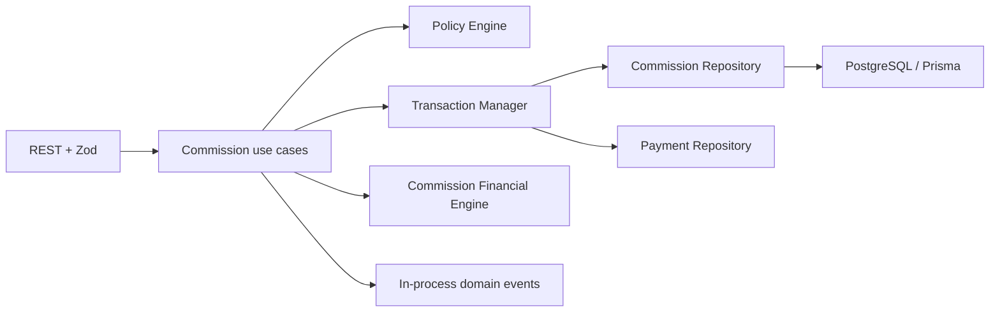

# Commission Engine

## Scope

Phase 6 calculates, previews, approves, locks, and summarizes employee commission. It does not implement payroll, salary payment, accounting journals, exports, dashboards, notifications, or UI. Booking and Payment remain upstream, unchanged bounded contexts.

## Architecture

The module follows the frozen application foundation:

Use cases and controllers never import Prisma. Every operation evaluates `CommissionPolicy`; repositories independently apply organization and branch predicates. Every write executes through `TransactionManager.withTransaction()`, which uses PostgreSQL `SERIALIZABLE` isolation.

## Ledger Model

- `CommissionHistory` remains the immutable, one-per-BookingItem base calculation and rule snapshot.
- `CommissionAdjustment` is an immutable delta. `RECALCULATION` can be positive or negative; `REFUND` must reduce the effective commission.
- `CommissionApproval` is an immutable, signed ledger approval per `CommissionHistory + posting period`, recording actor, reason, time, and the amount posted in that period.
- `CommissionPeriod` controls `OPEN -> APPROVED -> LOCKED`. Phase 6 has no unlock transition or endpoint.
- Effective commission is `CommissionHistory.commissionAmount + ordered adjustment deltas`; stored `resultingAmount` allows integrity reconciliation.
- Financial records have no delete repository method and are protected by restrictive foreign keys.

## Calculation Flow

1. Load the tenant/branch-scoped BookingItem, Payment, and PaymentRefund ledgers.
2. Require Booking `COMPLETED`, a non-null `saleClosedAt`, completed items, and aggregate `PAID` or `PARTIAL` state.
3. Exclude void payments and subtract immutable refunds to obtain net paid.
4. Calculate each item base from its snapshot. Included VAT is removed; current Service/BranchService prices are never read.
5. Allocate booking discount and the paid proportion across items with largest remainder. Ties sort by BookingItem UUID, making results deterministic.
6. Resolve an effective CommissionRule, calculate integer cents with half-up rounding, and preview without persistence.
7. Calculation takes advisory locks and inserts one immutable `CommissionHistory` per item.

Default base is net BookingItem amount before tax. Partial payment is proportional to `net paid / booking grand total`. Explicit API periods use half-open UTC instants `[dateFrom, dateTo)`. Booking operations without a period use the UTC calendar month containing `saleClosedAt`.

## Rule Resolution

Candidates must be active, not soft-deleted, effective on sale close, and within organization/branch scope. Precedence is:

1. Employee-specific
2. Service-specific
3. Branch-specific
4. Organization default

Combined specificity wins, then higher `priority`, later `effectiveFrom`, and finally UUID ascending. No match returns a business-rule failure.

- `PERCENT`: `base * percentageRate`, half-up.
- `FIXED`: fixed amount per eligible BookingItem. An intentional fixed amount may exceed its base.
- `TIER`: selects one flat tier using the employee's cumulative eligible base in the requested period; this is not progressive tiering.
- `MIXED`: fixed component plus percentage component. It must not exceed the base.

## Recalculation

Recalculation is allowed only while the target period is `OPEN` and the base record is not approved. It never updates `CommissionHistory`; the difference between previous effective amount and newly calculated amount becomes a `RECALCULATION` adjustment. A zero difference creates no ledger row.

## Refund Adjustment

Refund processing is explicit and idempotent per `PaymentRefund + BookingItem`. Current net paid is reallocated from before-tax BookingItem weights. The effective commission is reduced proportionally and a negative `REFUND` adjustment is inserted.

Multiple refunds are ordered by `createdAt` and UUID. Earlier refunds must have adjustments before a later refund can post; the engine calculates net paid through the selected refund, so delayed processing cannot attribute several refunds to one ledger record. A full refund allocates zero base and reduces effective commission to zero.

If the original period is `OPEN`, the adjustment posts there. If it is `APPROVED` or `LOCKED`, the adjustment posts to the UTC month containing `PaymentRefund.createdAt`. Locked history is never modified or reopened. The destination period must be open.

## Approval And Lock

Approval records the signed ledger amount posted for one base history in the selected period. A base may therefore have a positive approval in its sale period and a negative carry-forward approval in a later refund period. Once any posting for a base has been approved, that base cannot be recalculated because its immutable approval snapshot would otherwise disagree. When every base or adjustment source posted in the period has an approval, the period becomes `APPROVED`. Lock requires a non-empty period, zero unapproved sources, and changes it to `LOCKED`. Phase 6 deliberately provides no unlock path.

## Concurrency And Integrity

Sorted transaction advisory locks are namespaced by organization and cover booking, payment, refund, commission, and period keys. Unique constraints prevent duplicate base history, refund/item adjustment, approval, and period scope. Database checks enforce valid ranges, non-negative resulting balances, and `previous + delta = resulting`.

All financial arithmetic uses integer cents in application code and `DECIMAL(12,2)` snapshots in PostgreSQL. JavaScript floating point is not used.

## API And Policy

Routes are documented in `docs/API.md`. Permission keys are:

`commission.preview`, `commission.calculate`, `commission.read`, `commission.recalculate`, `commission.adjust`, `commission.approve`, `commission.lock`, `commission.rule.read`, `commission.rule.manage`, and `commission.summary.read`.

Write audit actions include `commission.booking.calculated`, `commission.employee.calculated`, `commission.period.calculated`, `commission.recalculated`, `commission.adjustment.applied`, `commission.approved`, and `commission.period.locked`. Audit is supplied through existing HTTP middleware, never written by use cases.

Domain events are `CommissionPreviewed`, `BookingCommissionCalculated`, `BookingItemCommissionCalculated`, `EmployeeCommissionCalculated`, `CommissionPeriodCalculated`, `CommissionRecalculated`, `CommissionAdjustmentApplied`, `CommissionApproved`, `CommissionPeriodLocked`, and `CommissionSummaryGenerated`. Delivery is in-process after transaction completion.

## Error Cases

Expected failures use `Result` and map to the existing API standard: missing rule, ineligible/unpaid/unclosed booking, duplicate calculation, invalid base/tier, approval mismatch, non-open period, duplicate refund adjustment, tenant/branch isolation, and serializable conflict. Technical database failures throw only to force transaction rollback and are sanitized by the global handler.

## Operational Requirements

- Deploy migration `0008_commission_ledger` before enabling routes.
- Provision all commission permission keys and role grants; the project has no permission seed/onboarding mechanism.
- Supply offset-aware `dateFrom`/`dateTo`; clients are responsible for converting branch-local day/week/month boundaries to UTC.
- Monitor serializable conflicts and retry complete client commands with the same business identifiers.

## Known Limitations

- Tier mode is flat only.
- Period boundaries are explicit UTC instants; automatic branch-timezone daily/weekly calendars belong to reporting orchestration.
- A fixed commission is reduced proportionally by refund rather than retained until a full refund.
- Payroll and payout state are intentionally absent.
