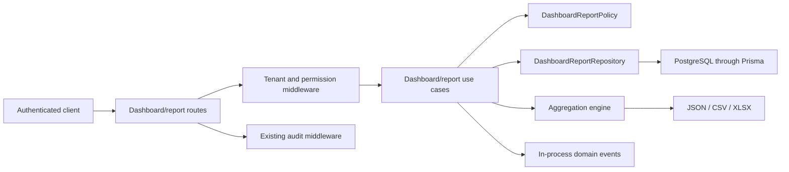

# Dashboard And Reports

## Scope

Phase 7 adds read-only dashboard aggregation, paginated JSON reports, and synchronous CSV/XLSX export. It reuses authentication, tenant context, RBAC, Policy Engine, Result Pattern, Domain Events, Audit Middleware, Clock, and the repository composition root. It does not add tables, migrations, frontend code, background jobs, caching, PDF, scheduled reports, payroll, or accounting journals.

## Architecture

Use cases never import Prisma. `PrismaDashboardReportRepository` loads bounded, tenant-scoped facts from existing domain tables. `DashboardReportEngine` performs pure aggregation with integer cents. `DashboardReportExporter` owns format-specific output and spreadsheet-injection defenses.

## Data Sources And Attribution

| Metric family | Source | Range timestamp |
| --- | --- | --- |
| Booking | `Booking`, active `BookingItem` snapshots | `Booking.startsAt` |
| Sales | completed closed sale and active `BookingItem` snapshots | `Booking.saleClosedAt` |
| Payment | immutable `Payment` ledger | `Payment.paidAt` |
| Refund | immutable `PaymentRefund` ledger | `PaymentRefund.createdAt` |
| Commission | `CommissionHistory`, `CommissionAdjustment`, approval/period state | `calculatedAt` |
| Customer | `Customer` and completed visits | `Customer.createdAt` / sale close |
| Capacity | `WorkingHour`, approved `EmployeeTimeOff`, closed `Holiday` | local calendar date |

Sales include only `Booking.status = COMPLETED`, non-deleted bookings with `saleClosedAt`, and non-cancelled booking items. Historical revenue always uses the `BookingItem` price, discount, tax, and total snapshots rather than current service prices.

New customers are attributed by `Customer.createdAt`. In a branch-scoped report, creation is attributed to `Customer.preferredBranchId`; active customers are attributed by the branch of their completed closed sale.

## Metric Definitions

All money fields are integer cents in API responses. Persisted PostgreSQL `Decimal(12,2)` values cross the repository boundary as fixed two-decimal strings and are converted to `bigint` for aggregation. A result outside JavaScript's safe integer range fails with `ReportDataIntegrityError`.

| Metric | Formula |
| --- | --- |
| `grossSales` | sum of active `BookingItem.subtotalAmount` |
| `discountTotal` | item discounts + `BookingDiscount.discountAmount` |
| `taxTotal` | sum of `BookingItem.taxAmount` |
| `netSales` | `grossSales - discountTotal` |
| `paidAmount` | sum of non-VOID payments |
| `refundedAmount` | sum of refund ledger amounts |
| `netPaidAmount` | `paidAmount - refundedAmount` |
| `outstandingAmount` | `max(grandTotal - netPaidAmount, 0)` for sales closed in range, evaluated from current ledger state |
| `commissionTotal` | `CommissionHistory.commissionAmount + CommissionAdjustment.adjustmentAmount` |
| `averageTicketSize` | net sales / completed closed sales, half-up |
| rate fields ending `Bps` | ratio multiplied by 10,000, half-up |

Booking-level discounts are allocated to items proportional to each item's before-tax amount after item discount. Refund impact uses the same before-tax weights. Integer division remainders go to the lexicographically last `BookingItem.id`, making repeated calculations deterministic. Refund impact is reported separately and does not rewrite net sales.

Employee utilization is completed booking-item minutes divided by scheduled working minutes. Scheduled minutes subtract closed holidays and approved overlapping time off. Current `WorkingHour` records are not historical schedule snapshots; this limitation is tracked below.

## Date And Timezone Policy

Data is stored and queried as UTC instants. API date-only inputs are interpreted at midnight in the requested IANA timezone and converted into a half-open UTC range `[dateFrom, dateTo)`. Datetime inputs must include an offset. The default timezone is `Asia/Bangkok`; server-local time is never implicit.

`period` accepts `TODAY`, `THIS_WEEK`, `THIS_MONTH`, `LAST_MONTH`, and `THIS_YEAR`. It is mutually exclusive with `dateFrom`/`dateTo`; omitting both defaults to `THIS_MONTH`. The maximum range is 366 days. `granularity` accepts `daily`, `weekly`, `monthly`, and `custom`.

## Tenant And Branch Filtering

Every repository query includes `organizationId`, branch scope where relevant, and existing soft-delete filters. An explicit `branchId` or `X-Branch-ID` restricts the result to that authorized branch. Without an explicit branch, organization-wide grants can query all active organization branches; branch grants query only branches granting the required permission. Cross-tenant and unauthorized branch identifiers fail closed.

## Permissions

Dashboard and report use cases always evaluate `DashboardReportPolicy`. Routes also use the existing permission middleware.

- `dashboard.read`
- `report.read`
- `report.export`
- `sales.summary.read`
- `booking.summary.read`
- `payment.summary.read`
- `commission.summary.read`
- `employee.performance.read`
- `service.performance.read`
- `customer.analytics.read`
- `branch.summary.read`

Report generation requires `report.read` plus its domain permission. Export requires `report.export` plus its domain permission. These keys must be provisioned through the operational RBAC bootstrap process; Phase 7 does not mutate RBAC data.

## API

Dashboard endpoints are `GET` requests under `/api/dashboard`; report generation and export are `POST` requests under `/api/reports`. Full endpoint and request details are in `docs/API.md`.

Common filters: `dateFrom`, `dateTo`, `period`, `timezone`, `branchId`, `employeeId`, `serviceId`, `customerId`, `granularity`, `keyword`, `status`, `page`, `pageSize`, `sort`, and `order`. Page size is 1-100.

Report types: `sales`, `bookings`, `payments`, `commissions`, `employee-performance`, `service-performance`, `customers`, and `branches`.

## Export Rules

CSV uses UTF-8 with BOM, RFC-style quoting, deterministic column selection, and a safe filename. XLSX uses ExcelJS, a sanitized worksheet name, frozen headers, fixed column widths, and cents-based numeric formatting. Values beginning with `=`, `+`, `-`, or `@` are prefixed with an apostrophe in both formats to prevent formula injection. Requested columns must exist in the result set.

Exports intentionally omit customer phone and email. Responses set explicit content type, attachment filename, content length, and `X-Content-Type-Options: nosniff`.

## Performance Limits

- Dashboard repository fact limit: 50,000 rows per bounded source.
- Report/export fact limit: 10,000 rows per bounded source.
- Maximum date range: 366 days.
- Maximum JSON page size: 100 rows.
- Repository reads execute as a fixed parallel query set with relation projections; no per-row queries are issued.
- Any truncated source fails with `ReportRowLimitExceededError`; partial financial reports are never returned.
- CSV and XLSX are synchronous and memory-backed in this phase. A job/streaming architecture is deferred until production volume requires it.

## Events And Audit

The module publishes `DashboardViewed`, `ReportGenerated`, `ReportExported`, `SalesSummaryGenerated`, `BookingSummaryGenerated`, `PaymentSummaryGenerated`, `CommissionSummaryGenerated`, `EmployeePerformanceGenerated`, `ServicePerformanceGenerated`, `CustomerAnalyticsGenerated`, and `BranchSummaryGenerated` through the existing in-process dispatcher.

Generated reports and exports attach `report.generated` or `report.exported` metadata to the existing audit pipeline. High-frequency dashboard reads are not persisted as audit records to control audit-log growth; they remain observable through domain events and request logs. No use case writes `AuditLog` directly.

## Known Limitations

- Outstanding balances are current ledger state for sales closed in the requested range, not a historical as-of snapshot.
- Working hours are effective-dated but are not immutable schedule snapshots; retroactive edits can change historical utilization.
- Export is synchronous and memory-backed; the strict row limit protects API tasks.
- No materialized views or cache are present. Larger installations should measure query latency before adding either.
- Permission keys have no versioned seed/onboarding mechanism yet.

## Future Improvements

Phase 8 can consume these APIs for admin cards, tables, filters, and charts without duplicating financial calculations. Later phases may add asynchronous export jobs, object storage, report history, streaming CSV, historical schedule snapshots, materialized aggregates, and observability thresholds after measured demand.
