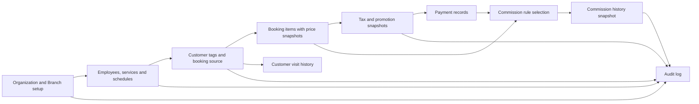

# Salon Management System - Database Design

## 1. Scope

เอกสารนี้อธิบาย Domain Model และ PostgreSQL schema สำหรับ Phase 1 เท่านั้น ครอบคลุมโครงสร้างข้อมูล, ความสัมพันธ์, constraints, indexes และ migration โดยยังไม่มี API, UI, booking logic, payment processing หรือ commission calculation

Canonical Prisma schema อยู่ที่ `apps/api/prisma/schema.prisma` ตามโครงสร้าง monorepo เดิม และ migration อยู่ที่ `apps/api/prisma/migrations/0004_salon_domain/migration.sql`

## 2. Domain Boundaries

| Bounded Context | Aggregate / Entity หลัก | หน้าที่ |
| --- | --- | --- |
| Organization | Organization, Branch, Setting | ขอบเขตข้อมูลของกิจการและการตั้งค่าระดับองค์กร/สาขา |
| Identity & Access | User, Role, Permission, UserRole, RolePermission | บัญชีผู้ใช้และ RBAC แบบกำหนดสิทธิ์ได้ทั้งองค์กรหรือเฉพาะสาขา |
| Workforce | Employee, EmployeeBranch, Skill, EmployeeSkill, ServiceSkill, WorkingHour, EmployeeTimeOff, Holiday | พนักงาน, ความสามารถ, สาขาที่ทำงาน, ตารางประจำ และข้อยกเว้นวันหยุด/การลา |
| Customer & CRM | Customer, CustomerTag, CustomerTagAssignment | ข้อมูลลูกค้า, segment/tag และจุดเชื่อมไปยังประวัติการรับบริการ |
| Service Catalog | ServiceCategory, Service, BranchService | หมวดบริการ, บริการกลาง และราคา/ระยะเวลาที่ override รายสาขา |
| Booking | Booking, BookingItem, Promotion, BookingDiscount | หัวรายการจอง, บริการ, tax snapshot และส่วนลดที่ตรวจย้อนหลังได้ |
| Finance | Payment, CommissionRule, CommissionTier, CommissionHistory | การรับชำระ, กฎค่าคอมทุกชนิด และผลคำนวณที่เก็บเป็นหลักฐานย้อนหลัง |
| Governance | AuditLog | หลักฐานการเปลี่ยนแปลงข้อมูลสำคัญสำหรับ security และ operations |

โครงสร้างเหมาะกับ modular monolith ในระยะแรก แต่แต่ละ context มี ownership ชัดเจน จึงแยก module หรือ service ในอนาคตได้โดยไม่ต้องออกแบบฐานข้อมูลใหม่ทั้งหมด

## 3. Entity Catalog

ทุกตารางใช้ UUID primary key และมี `createdAt`, `updatedAt` ชนิด `TIMESTAMPTZ(3)` ตาราง master/operational ที่ผู้ใช้สามารถยกเลิกการใช้งานมี `deletedAt`; ตารางหลักฐานทางการเงินและ audit ไม่ใช้ soft delete

| Entity | รายละเอียด | Soft delete |
| --- | --- | --- |
| Organization | Tenant/root ของกิจการ เก็บ timezone และ ISO 4217 currency | Yes |
| Branch | สาขาภายใต้องค์กร รองรับที่อยู่, timezone override และสถานะใช้งาน | Yes |
| User | บัญชีเข้าใช้ระบบ เก็บเฉพาะ password hash และสถานะบัญชี | Yes |
| Role | กลุ่มสิทธิ์ที่องค์กรกำหนด | Yes |
| Permission | permission key กลาง เช่น `booking.read` | Yes |
| RolePermission | ความสัมพันธ์ many-to-many ระหว่าง Role และ Permission | Yes |
| UserRole | การมอบ Role ให้ User ทั้งระดับองค์กรหรือสาขา | Yes |
| Employee | โปรไฟล์พนักงาน แยกจาก User เพราะพนักงานอาจไม่มีบัญชีเข้าใช้ | Yes |
| EmployeeBranch | ความสัมพันธ์ many-to-many ของพนักงานกับสาขา และระบุสาขาหลัก | Yes |
| Customer | ลูกค้าในระดับองค์กร พร้อม preferred branch และข้อมูลติดต่อ | Yes |
| CustomerTag | Tag/segment ที่องค์กรกำหนดเอง เช่นกลุ่มสมาชิกหรือกลุ่มเฝ้าระวัง | Yes |
| CustomerTagAssignment | ความสัมพันธ์ many-to-many ของ Customer และ CustomerTag | Yes |
| ServiceCategory | หมวดบริการสำหรับ catalog, reporting และ dashboard | Yes |
| Service | บริการมาตรฐาน, ระยะเวลา, buffer และราคาฐาน | Yes |
| BranchService | เปิด/ปิดบริการในสาขา พร้อม override ราคาและระยะเวลา | Yes |
| Skill | ความสามารถกลางขององค์กรที่ใช้ประเมิน eligibility ของพนักงาน | Yes |
| EmployeeSkill | skill และระดับความชำนาญ/อายุ certification ของพนักงาน | Yes |
| ServiceSkill | skill และระดับขั้นต่ำที่บริการต้องการ | No; เป็นข้อกำหนดอ้างอิง |
| Booking | หัวการจอง ระบุสาขา, ลูกค้า, ช่วงเวลา, source และสถานะ | Yes |
| BookingItem | บริการย่อย ระบุพนักงาน พร้อม snapshot ราคา, tax mode/rate/amount | No; ใช้ status `CANCELLED` |
| Promotion | Promotion ระดับองค์กรหรือสาขา พร้อมช่วงเวลาและ usage limit | Yes |
| BookingDiscount | Snapshot ส่วนลดที่ใช้จริง รองรับ promotion/manual และหลายส่วนลด | No |
| Payment | รายการชำระหรือคืนเงินที่ผูกกับ Booking รองรับหลายรายการต่อการจอง | No |
| CommissionRule | กฎค่าคอมแบบ PERCENT, FIXED, TIER หรือ MIXED | Yes |
| CommissionTier | ช่วงฐานเงินและ rate/fixed component ของกฎแบบขั้นบันได | Yes |
| CommissionHistory | ผลค่าคอมต่อ BookingItem พร้อม snapshot ของกฎและฐานคำนวณ | No |
| WorkingHour | ช่วงเวลาทำงานประจำต่อ EmployeeBranch และวันในสัปดาห์ | Yes |
| Holiday | ช่วงปิดหรือวันหยุดพิเศษระดับสาขา | Yes |
| EmployeeTimeOff | การลา/เวลาที่พนักงานไม่พร้อมทำงาน พร้อมสถานะอนุมัติ | Yes |
| Setting | key/value JSON แบบ typed ระดับองค์กรหรือสาขา | Yes |
| AuditLog | append-only audit record ของ actor, action และ entity | No |

Entity ที่เพิ่มจากรายการขั้นต่ำมีเหตุผลดังนี้:

- `Organization` และ `Branch` ทำให้ทุก master data มี owner ชัดเจนและรองรับหลายสาขาโดยไม่ย้ายโครงสร้างหลักภายหลัง
- `EmployeeBranch` รองรับพนักงานทำงานมากกว่าหนึ่งสาขา
- `ServiceCategory` และ `BranchService` ช่วยจัดกลุ่ม dashboard และรองรับ catalog กลางที่ต่างราคา/ระยะเวลารายสาขา
- `CustomerTag` ใช้ entity แทน enum เพื่อให้ CRM เพิ่ม tag ได้โดยไม่ทำ database migration
- `EmployeeSkill` และ `ServiceSkill` ทำให้ระบบตรวจได้ว่าพนักงานมีทักษะและระดับที่บริการต้องการ
- `Promotion` และ `BookingDiscount` แยก definition ออกจาก transaction snapshot และรองรับหลายส่วนลดต่อ Booking
- `CommissionTier` ทำให้กฎแบบขั้นบันไดเป็น relational data ที่ตรวจ constraint และ query ได้
- `UserRole` และ `RolePermission` ทำให้ RBAC เป็น 3NF และไม่เก็บ permission ซ้ำใน User/Role
- `EmployeeTimeOff` แยกวันลารายบุคคลออกจาก `Holiday` ซึ่งเป็นเวลาปิดระดับสาขา
- `AuditLog` รองรับ security review และการสืบค้นการเปลี่ยนแปลงข้อมูลสำคัญ

## 4. Relationship Summary

- Organization 1:N Branch, User, Role, Employee, Customer, Service, CommissionRule, Setting และ AuditLog
- Branch M:N Employee ผ่าน EmployeeBranch
- Branch M:N Service ผ่าน BranchService
- ServiceCategory 1:N Service
- Customer M:N CustomerTag ผ่าน CustomerTagAssignment
- Employee M:N Skill ผ่าน EmployeeSkill และ Service M:N Skill ผ่าน ServiceSkill
- Role M:N Permission ผ่าน RolePermission
- User M:N Role ผ่าน UserRole โดย `branchId = null` หมายถึงสิทธิ์ระดับองค์กร
- User 0..1:0..1 Employee; บัญชีและข้อมูลการจ้างงานมี lifecycle แยกกัน
- Customer 1:N Booking และ Branch 1:N Booking
- Booking 1:N BookingItem และ Booking 1:N Payment
- Booking 1:N BookingDiscount และ Promotion 1:N BookingDiscount แบบ optional
- BookingItem N:1 Service และ N:1 Employee
- BookingItem 1:0..1 CommissionHistory เพื่อป้องกันการลงค่าคอมซ้ำ
- CommissionRule 1:N CommissionHistory; Payment 1:N CommissionHistory แบบ optional
- CommissionRule 1:N CommissionTier สำหรับกฎชนิด `TIER`
- EmployeeBranch 1:N WorkingHour
- Employee 1:N EmployeeTimeOff และ Branch 1:N Holiday

Foreign key ที่เป็นข้อมูลประวัติใช้ `ON DELETE RESTRICT` เป็นหลัก การลบเชิงกายภาพจึงไม่ทำลาย booking/finance history ส่วน actor ที่อาจหายไป เช่นผู้รับชำระหรือผู้ตรวจคำขอลา ใช้ `ON DELETE SET NULL` แต่ยังคง record ธุรกิจไว้

## 5. ER Diagram

```mermaid
erDiagram
    ORGANIZATION ||--o{ BRANCH : owns
    ORGANIZATION ||--o{ USER : owns
    ORGANIZATION ||--o{ ROLE : defines
    ORGANIZATION ||--o{ EMPLOYEE : employs
    ORGANIZATION ||--o{ CUSTOMER : serves
    ORGANIZATION ||--o{ SERVICE : catalogs
    ORGANIZATION ||--o{ SERVICE_CATEGORY : classifies
    ORGANIZATION ||--o{ CUSTOMER_TAG : defines
    ORGANIZATION ||--o{ SKILL : defines
    ORGANIZATION ||--o{ PROMOTION : offers
    ORGANIZATION ||--o{ COMMISSION_RULE : defines
    ORGANIZATION ||--o{ SETTING : configures
    ORGANIZATION ||--o{ AUDIT_LOG : records

    ROLE ||--o{ ROLE_PERMISSION : grants
    PERMISSION ||--o{ ROLE_PERMISSION : belongs_to
    USER ||--o{ USER_ROLE : receives
    ROLE ||--o{ USER_ROLE : assigned_as
    BRANCH o|--o{ USER_ROLE : scopes

    USER o|--o| EMPLOYEE : login_for
    EMPLOYEE ||--o{ EMPLOYEE_BRANCH : assigned_to
    BRANCH ||--o{ EMPLOYEE_BRANCH : staffs
    EMPLOYEE_BRANCH ||--o{ WORKING_HOUR : schedules
    EMPLOYEE ||--o{ EMPLOYEE_SKILL : has
    SKILL ||--o{ EMPLOYEE_SKILL : certifies
    EMPLOYEE ||--o{ EMPLOYEE_TIME_OFF : requests
    BRANCH o|--o{ EMPLOYEE_TIME_OFF : scopes
    BRANCH ||--o{ HOLIDAY : observes

    SERVICE ||--o{ BRANCH_SERVICE : offered_as
    BRANCH ||--o{ BRANCH_SERVICE : offers
    SERVICE_CATEGORY ||--o{ SERVICE : groups
    SERVICE ||--o{ SERVICE_SKILL : requires
    SKILL ||--o{ SERVICE_SKILL : qualifies

    CUSTOMER ||--o{ CUSTOMER_TAG_ASSIGNMENT : tagged_with
    CUSTOMER_TAG ||--o{ CUSTOMER_TAG_ASSIGNMENT : classifies

    CUSTOMER ||--o{ BOOKING : makes
    BRANCH ||--o{ BOOKING : receives
    USER o|--o{ BOOKING : creates
    BOOKING ||--|{ BOOKING_ITEM : contains
    SERVICE ||--o{ BOOKING_ITEM : snapshots
    EMPLOYEE ||--o{ BOOKING_ITEM : performs

    BOOKING ||--o{ PAYMENT : paid_by
    BOOKING ||--o{ BOOKING_DISCOUNT : receives
    PROMOTION o|--o{ BOOKING_DISCOUNT : snapshots
    USER o|--o{ PAYMENT : receives
    COMMISSION_RULE ||--o{ COMMISSION_HISTORY : produces
    COMMISSION_RULE ||--o{ COMMISSION_TIER : defines
    BOOKING_ITEM ||--o| COMMISSION_HISTORY : earns
    EMPLOYEE ||--o{ COMMISSION_HISTORY : receives
    PAYMENT o|--o{ COMMISSION_HISTORY : settles

    BRANCH o|--o{ SETTING : overrides
    USER o|--o{ AUDIT_LOG : acts
```



## 6. Key Design Decisions

### 6.1 Multi-branch readiness

ข้อมูลกลางอยู่ใต้ Organization ส่วนการปฏิบัติงานอยู่ใต้ Branch ตารางเชื่อมทำให้เพิ่มสาขาใหม่ได้โดยไม่เพิ่มคอลัมน์ใน Employee หรือ Service ค่า Setting ระดับสาขามี precedence เหนือค่าระดับองค์กร แต่การ resolve ค่านี้เป็นงานของ application ใน Phase 2

### 6.2 Transaction snapshots

`BookingItem` เก็บ `serviceName`, `durationMinutes`, `unitPrice`, `discountAmount` และ `totalAmount` เป็น snapshot โดยตั้งใจ แม้ค่าต้นทางอยู่ใน Service/BranchService เพื่อให้ใบจองเก่าคงความหมายเดิมหลังมีการเปลี่ยนชื่อหรือราคา นี่เป็น immutable transaction fact ไม่ใช่ master-data duplication

`CommissionHistory` ใช้หลักเดียวกัน โดยเก็บชื่อกฎ, ชนิด, rate/fixed amount, base amount และผลลัพธ์ ณ เวลาคำนวณ จึงตรวจย้อนหลังได้แม้ CommissionRule ถูกแก้หรือ soft-delete

`BookingDiscount` เก็บ promotion code, ชนิด, ค่า rule และยอดส่วนลดที่ใช้จริง ส่วน `BookingItem` เก็บ tax type/mode/rate/amount จึงออกเอกสารย้อนหลังได้แม้ Promotion, Service หรืออัตราภาษีเปลี่ยน

### 6.3 Extensible category, tags and skills

Service Category, Customer Tag และ Skill เป็น master entities ไม่ใช่ enum เพราะเป็น business vocabulary ที่แต่ละองค์กรต้องเพิ่ม/ปิดใช้ได้ การเชื่อม Skill สองด้านทำให้ eligibility เป็นเส้นทาง `Employee -> EmployeeSkill -> Skill <- ServiceSkill <- Service` โดยไม่ผูกพนักงานตรงกับบริการทุกตัว

### 6.4 Money, tax and time

- จำนวนเงินใช้ `DECIMAL(12,2)` ไม่ใช้ floating point
- Tax ใช้ enum `TaxType` (`NONE`, `VAT`) และ `TaxMode` (`INCLUDED`, `EXCLUDED`) พร้อม check constraint ของ rate/amount
- currency ใช้รหัสตัวพิมพ์ใหญ่ 3 ตัว และเก็บบน Organization/Payment เพื่อรองรับการตรวจย้อนหลัง
- instant ใช้ `TIMESTAMPTZ`; วันล้วนใช้ `DATE`; เวลาทำงานประจำใช้ `TIME`
- Organization มี timezone บังคับ และ Branch override ได้ เพื่อแปลงเวลาท้องถิ่นอย่างสม่ำเสมอใน Phase 2

### 6.5 Soft delete and history

Partial unique indexes บังคับความไม่ซ้ำเฉพาะ record ที่ `deletedAt IS NULL` ทำให้ code/email/key เดิมกลับมาใช้ใหม่ได้เมื่อข้อมูล master ถูกลบเชิงตรรกะ BookingItem, Payment, CommissionHistory และ AuditLog ไม่ควรถูกลบ; ใช้สถานะธุรกิจหรือ reversal/refund record ใน Phase ต่อไป

### 6.6 Settings and secrets

Setting เป็น JSON ที่มี `valueType` และ check constraint ตรวจชนิดจริง ฟิลด์ `isSensitive` ใช้กำหนดนโยบาย redaction/access control ใน Phase 2 แต่ secret ของ infrastructure เช่น JWT secret หรือ payment credentials ต้องอยู่ใน AWS Secrets Manager ไม่ใช่ตารางนี้

### 6.7 3NF and integrity

- many-to-many ทุกจุดมี associative entity และ primary key ของตนเอง
- ไม่มี role/permission, branch/service หรือ employee/branch arrays ฝังใน record หลัก
- ค่าที่อนุมานได้ เช่นยอดรวม Booking ไม่ถูกเก็บซ้ำ; คำนวณจาก BookingItem และ Payment
- Snapshot ใน transaction tables เป็นข้อยกเว้นที่จำเป็นต่อ auditability
- กฎค่าคอมแบบ TIER แยกช่วงไว้ใน CommissionTier; MIXED ใช้ทั้ง percentage และ fixed component
- PostgreSQL check constraints ป้องกันจำนวนเงินติดลบ, ช่วงเวลาย้อนกลับ, day-of-week ผิดช่วง และกฎค่าคอมที่มี rate/fixed amount ไม่ตรงชนิด

## 7. Index Strategy

Indexes ออกแบบจาก access paths ที่คาดว่าจะใช้จริง:

- ตารางนัดหมายรายสาขา: `(branchId, startsAt, status, deletedAt)`
- ตารางงานพนักงาน: `(employeeId, startsAt, endsAt)`
- ประวัติลูกค้า: `(customerId, startsAt)`
- การชำระ: `(bookingId, status)` และ `(status, paidAt)`
- ค่าคอม: `(employeeId, status, calculatedAt)` และ rule matching keys
- ตารางเวลา/วันลา: employee/branch + time range
- lookup master data: organization + code/name/contact + active/deleted state
- dashboard/CRM: service category, customer tag และ promotion code
- skill matching: employee/skill และ service/skill composite indexes
- partial unique indexes ใช้กับ email, code, role, permission, scoped role และ setting keys

PostgreSQL ไม่สร้าง index ให้ foreign key อัตโนมัติ จึงมี index สำหรับ FK ที่ใช้ join/filter เป็นประจำอยู่ใน schema

## 8. Data Flow (Summary)



1. สร้าง Organization/Branch แล้วกำหนดผู้ใช้, RBAC, พนักงาน, catalog และเวลาให้บริการ
2. Booking เก็บ source เพื่อวิเคราะห์ marketing; CustomerTag ใช้แบ่ง segment โดยไม่แก้ schema
3. BookingItem แยกบริการ/พนักงานและ snapshot ราคา/ภาษี; BookingDiscount snapshot promotion หรือ manual discount
4. Payment หลาย record สามารถอ้าง Booking เดียว และใช้ status `PENDING`, `PAID`, `PARTIAL`, `REFUNDED`, `VOID`
5. Phase 2 จะ match EmployeeSkill กับ ServiceSkill ก่อนจอง และเลือก CommissionRule/Tier ตาม scope/priority/effective date
6. ประวัติลูกค้าอ่านจาก Customer -> Booking -> BookingItem -> Payment โดยไม่ต้องมีตารางประวัติซ้ำ

## 9. Migration

Migration `0004_salon_domain` เปลี่ยน starter Asset domain เป็น Salon domain และตั้งใจหยุดด้วย exception หากพบข้อมูลใน legacy tables เพื่อป้องกัน data loss แบบเงียบ หาก environment ใดมีข้อมูลจริง ต้องทำ data classification/mapping และ migration แยกก่อน deploy Phase 1

Migration `0005_domain_enhancements` เพิ่ม enum ชุดใหม่, category/tag/skill, tax, promotion และ tier commission ค่า enum เดิมที่ map ได้แน่นอนจะถูกแปลงให้ ส่วน migration จะหยุดหากพบข้อมูลที่ต้องตัดสินใจเอง (`STAFF`, `OTHER` หรือ Service/BookingItem ที่ต้อง backfill tax/category)

Migration `0007_pos_payment` เป็น expand-only migration สำหรับ Phase 5 โดยเพิ่ม aggregate `Booking.paymentStatus`, close-sale metadata, Payment void metadata และ immutable `PaymentRefund` ledger สำหรับ partial/multiple refunds ไม่มีการลบหรือเปลี่ยนชนิดคอลัมน์เดิม Payment amount ยังคง immutable และยอดสุทธิต้องคำนวณจาก Payment ลบด้วย PaymentRefund ภายใน serializable transaction

Migration `0008_commission_ledger` เป็น additive-only migration สำหรับ Phase 6 ไม่มีการ drop, rename หรือเปลี่ยนชนิดคอลัมน์เดิม เพิ่ม `CommissionAdjustment`, `CommissionApproval`, `CommissionPeriod` และ enum สำหรับ adjustment/period lifecycle เท่านั้น `CommissionHistory` ยังคงเป็น immutable base หนึ่งรายการต่อ BookingItem; การคำนวณใหม่และ refund ใช้ delta ledger, approval ใช้ immutable snapshot และ period เปลี่ยนได้ทางเดียว `OPEN -> APPROVED -> LOCKED` โดยไม่มี unlock

Commission ledger มี unique keys สำหรับ scope ของ period, approval ต่อ base history ต่อ posting period และ refund ต่อ BookingItem พร้อม check constraints ว่า period ไม่ย้อนกลับ, resulting amount ไม่ติดลบ และ `previousAmount + adjustmentAmount = resultingAmount` ค่า approval เป็น signed ledger amount จึงติดลบได้สำหรับ refund carry-forward Foreign key ทั้งหมดใช้ `RESTRICT` เพื่อป้องกัน hard delete financial history

คำสั่งตรวจและ deploy จาก `apps/api`:

```bash
npm run generate
npx prisma validate
npx prisma migrate deploy
```

Constraints และ partial indexes ที่ Prisma Schema Language แสดงไม่ได้ถูกเก็บใน SQL migration โดยตรง ห้ามใช้ `prisma db push` แทน migration ใน production เพราะ database-only constraints เหล่านี้อาจหายไป

## 10. Phase 2 Invariants

Database รับรอง referential integrity และ value constraints แล้ว ส่วน invariants ที่ต้องตรวจใน application transaction ได้แก่:

- entity ที่เชื่อมกันต้องอยู่ Organization เดียวกัน
- Employee ต้อง active และถูก assign ให้ Branch ของ Booking
- Service ต้อง active และเปิดใช้ใน Branch
- EmployeeSkill ต้องครบ ServiceSkill และถึงระดับขั้นต่ำ ณ เวลานัดหมาย
- BookingItem ต้องไม่ทับ WorkingHour, Holiday, EmployeeTimeOff หรือ BookingItem อื่นของพนักงาน
- ผลรวม Payment ตามสถานะต้องไม่เกิน/ผิดเงื่อนไขยอด Booking
- Promotion ต้องอยู่ใน scope/ช่วงเวลา/usage limit และ BookingDiscount ต้องไม่ทำให้ยอดติดลบ
- การคำนวณ VAT แบบ included/excluded ต้องใช้ decimal rounding policy เดียวกันทั้งระบบ
- การเลือก CommissionRule ต้อง deterministic ตาม scope, priority และ effective date
- ทุกคำสั่งทางการเงินต้อง idempotent และเขียน AuditLog ใน transaction เดียวกัน

กฎเหล่านี้ไม่ถูก implement ใน Phase 1 ตามขอบเขตที่กำหนด
