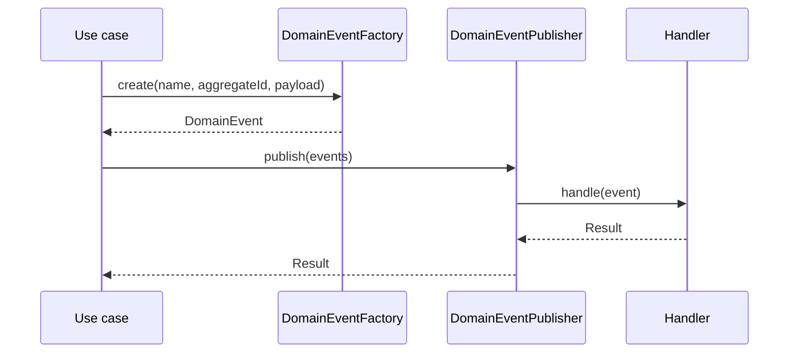

# Domain Events

## In-Process Events

`DomainEvent` contains an ID, event name, aggregate ID, occurrence time, and immutable payload. `DomainEventFactory` obtains time and identity from `Clock` and `IdGenerator`. Handlers return `Result<void, DomainError>`.

`InProcessDomainEventDispatcher` supports handler registration, single-event dispatch, and ordered publication. Publication stops on the first failed handler. It is synchronous within the application process and provides no delivery guarantee across restarts.

## Outbox Skeleton

`OutboxEvent`, `OutboxPublisher`, and `OutboxDispatcher` are contracts only. There is deliberately no Prisma model, persistence adapter, polling worker, broker, retry policy, or external send operation in Phase 3A. Adding a transactional outbox requires an explicitly approved schema change in a later phase.

## Event Rules

- Events describe completed domain facts and use stable past-tense names.
- Payloads contain identifiers and required facts, not ORM entities or secrets.
- Handlers must be idempotent before durable or retried delivery is introduced.
- External side effects must not be attached to the in-process dispatcher as if it were a reliable message bus.

