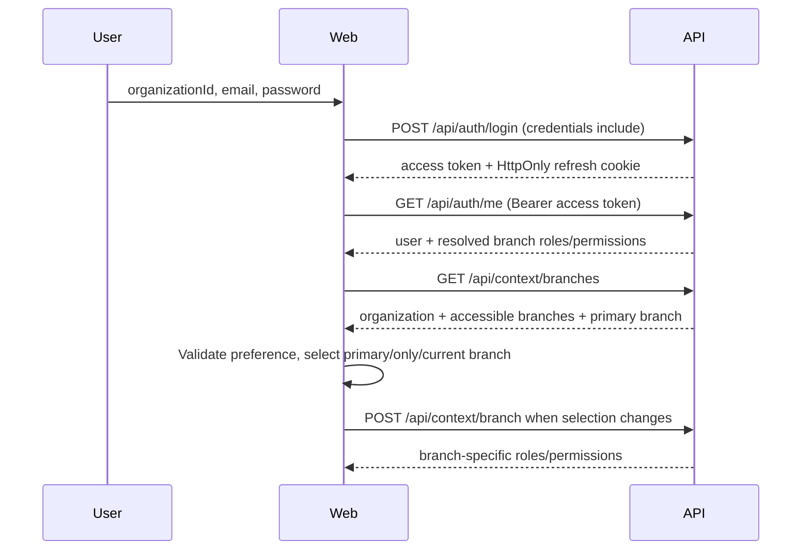

# Frontend Auth Foundation

## Scope

Phase 8A replaces the starter IT asset UI with a strict TypeScript React foundation for the Salon Management System. It provides authentication, session rotation, branch context, permission-aware routing, responsive admin layout, standardized API access, and test infrastructure. Business module screens remain outside this phase.

## Runtime Structure

```text
apps/web/src/
|-- api/          shared client, auth API, tenant/session API, safe errors
|-- auth/         AuthProvider, protected routes, permission gate
|-- branch/       BranchProvider, validated branch selection, runtime header state
|-- components/   sidebar, topbar, feedback, theme controls
|-- layouts/      authentication and admin layouts
|-- pages/        login, dashboard shell, forbidden, not found
|-- routes/       centralized route and permission definitions
|-- config/       validated frontend environment
|-- utils/        non-sensitive preferences and display helpers
`-- test/         Vitest and Testing Library setup
```

The frontend was migrated from JavaScript/JSX to TypeScript/TSX because the existing repository did not yet contain the TypeScript/Tailwind foundation described by the project brief. Phase 8A uses a scoped CSS token system instead of introducing Tailwind; this keeps the migration focused and avoids two styling systems.

## Authentication Flow



`AuthProvider` owns the current user, authoritative organization context, in-memory access token, roles, permissions, branch authorization context, and the session state machine:

- `loading`
- `authenticated`
- `unauthenticated`
- `forbidden`
- `expired`

The login form validates UUID, email, and password length before sending a request. Backend validation details are mapped to matching fields when available.

## Refresh Flow

The access token is memory-only. On application startup the provider calls `POST /api/auth/refresh`; the browser supplies the refresh cookie through `credentials: include`. A successful refresh is followed by `GET /api/auth/me`.

For protected API calls:

1. The shared client receives a `401`.
2. It starts or joins one shared refresh promise.
3. It retries the original request once after refresh succeeds.
4. A second `401` is returned as an error; it cannot start another retry.
5. Refresh failure clears in-memory session state and marks the session expired.

React Strict Mode bootstrap reuses one promise per provider mount so development effect replay cannot rotate the same refresh family twice.

## Logout Flow

`POST /api/auth/logout` sends the Bearer access token and credentials. The backend revokes the session and clears the HttpOnly cookie. The frontend clears the access token, branch header state, user, roles, and permissions in a `finally` block so local access is removed even during a network failure.

## Branch Context

`GET /api/context/branches` is an additive Phase 8A contract that reuses the existing tenant store and authenticated principal. It returns the active organization `{ id, name, displayName }` and active branches already filtered by organization and grants plus an `isPrimary` marker. The stored organization `name` is authoritative; `displayName` falls back to the authenticated organization ID only if the stored name is blank. `BranchProvider` writes this verified context into `AuthProvider`, and the Topbar and Dashboard shell render `displayName`.

`BranchProvider` applies this order:

1. Previously selected non-sensitive branch preference, only if still accessible.
2. Branch already resolved by `/auth/me`.
3. Primary branch.
4. The only accessible branch.
5. Explicit user selection when several branches have no default.

Every shared-client request includes `X-Branch-ID` when a validated current branch exists. Auth refresh, login, logout, branch discovery, and branch switch explicitly opt out where appropriate. Switching branch reloads roles and permissions from `POST /api/context/branch`.

## Permission Navigation

`PermissionGate` hides unauthorized navigation. Direct module routes use `ProtectedRoute` with the same permission and redirect to `/403` if authorization is missing. The backend remains the source of truth; UI filtering is not a security boundary.

| Navigation | Permission |
| --- | --- |
| Dashboard | `dashboard.read` |
| Reports | `report.read` |
| Customers | `customer.read` |
| Employees | `employee.read` |
| Services | `service.read` |
| Bookings | `booking.read` |
| POS | `pos.read` |
| Commissions | `commission.read` |
| Settings | `setting.manage` |

## API Client Strategy

All network traffic passes through `api/client.ts`. The client provides:

- `VITE_API_BASE_URL` resolution with a safe `/api` fallback
- `Authorization: Bearer` from memory
- `credentials: include`
- validated `X-Branch-ID`
- per-request `X-Request-ID`
- standard success-envelope unwrapping
- standard error mapping and validation details
- single-flight `401` refresh and one retry
- `403`, network, non-JSON, and internal error handling

Components do not call `fetch` directly.

## Environment

`apps/web/.env.example` documents:

```text
VITE_API_BASE_URL="/api"
```

Relative paths are accepted. Absolute production URLs must use HTTPS; localhost is allowed for development. No `.env` file is committed.

## Error Handling

Known `AUTH_*`, `PERMISSION_*`, `TENANT_*`, and `VALIDATION_*` errors receive user-safe messages. `DATABASE_*` and `INTERNAL_*` messages are always replaced with a generic response. Stack traces, raw database errors, tokens, and response internals are never rendered.

The application includes route-level feedback pages, loading states, inline form errors, branch-load recovery, and a React error boundary.

## Security Notes

- Refresh tokens remain in HttpOnly cookies and are never exposed to JavaScript.
- Access tokens are never written to localStorage or sessionStorage.
- Tokens are not logged.
- Local storage contains only theme and branch preferences.
- Stored branch preferences are checked against the current backend-provided accessible list before use.
- Permission-aware navigation improves UX but never replaces backend policy checks.
- Auth requests include cookies and depend on the backend trusted-origin/CORS configuration.

## Tests

Vitest, jsdom, and React Testing Library cover:

- login form validation
- provider login success and failure
- logout state clearing
- one-time refresh retry
- second-`401` loop prevention
- standard success and error envelopes
- Authorization and `X-Branch-ID` headers
- unauthenticated protected-route redirect
- unauthorized permission gate
- primary branch selection
- tenant-scoped organization display context and rendering
- HttpOnly cookie flags, rotation, reuse rejection, and logout clearing at the API HTTP layer

The browser procedure in `docs/FRONTEND_E2E_COOKIE_CHECK.md` covers checks that require a real browser and HTTPS deployment, including JavaScript cookie visibility, Web Storage, the `Secure` attribute, trusted origin behavior, and cookie path scope.

## Known Limitations

- Business module routes are permission-protected placeholders only.
- RBAC permission provisioning remains an operational prerequisite recorded in `TECH_DEBT.md`.
- Automated deployed-browser cookie verification remains pending; local/API automation and a production HTTPS manual checklist cover the current release gate.

## Phase 8B Readiness

Phase 8B can build Dashboard and Reports screens on the existing protected layout. It can add `dashboard.api.ts`, query state, filters, charts, tables, and export interactions without changing token storage, refresh handling, branch selection, permission navigation, or route ownership.
