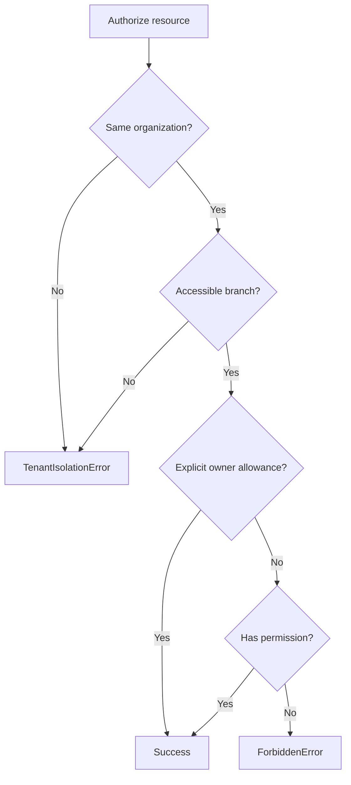

# Policy Engine

## Decision Model

The policy engine combines four inputs in this order:

1. Organization equality.
2. Branch membership when the resource is branch-scoped.
3. Explicit owner access only when the action opts in with `allowOwner`.
4. RBAC permission membership.

`BookingPolicy`, `CustomerPolicy`, and `EmployeePolicy` provide resource-specific type contracts over the shared scoped policy. The required permission is supplied by the future use case; it is not embedded as a hardcoded role or permission table in the engine.

## Security Rules

- Load resources with a tenant-scoped repository before policy evaluation.
- Never accept organization, branch, owner, or permissions from request body data.
- Build `PolicySubject` from the authenticated principal and resolved branch context.
- Owner access is denied by default.
- A branch-less resource remains organization-scoped; the use case may impose a stricter rule.

